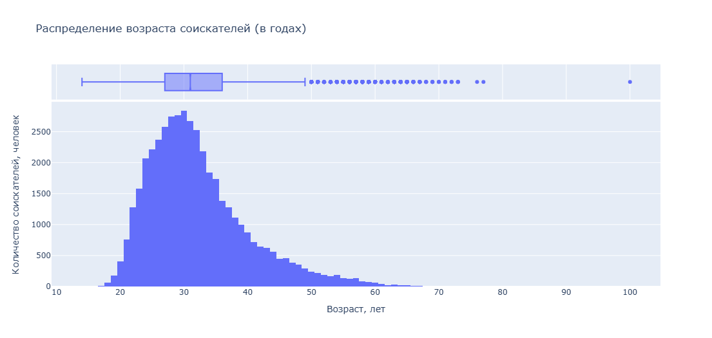
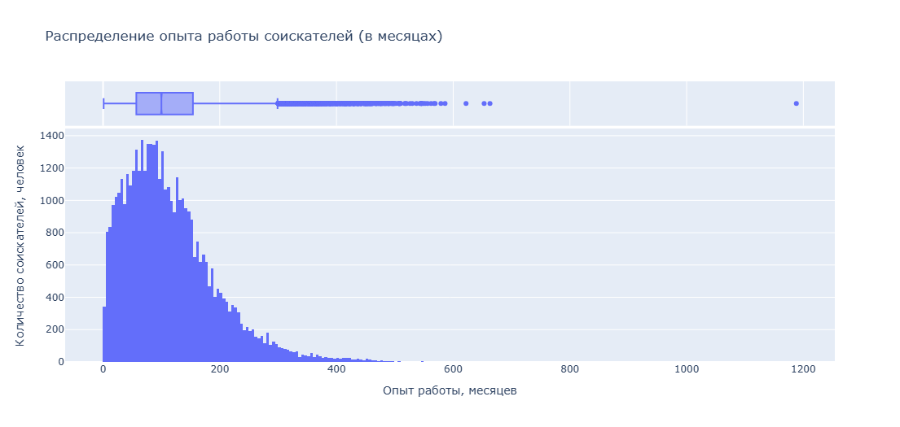
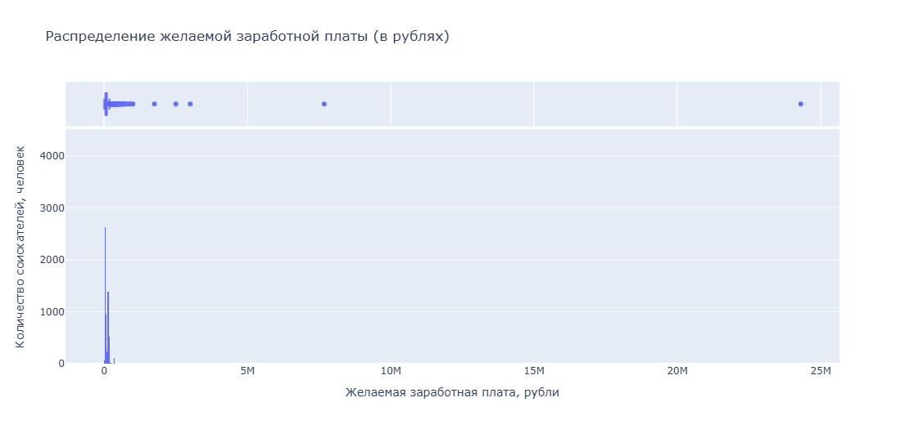
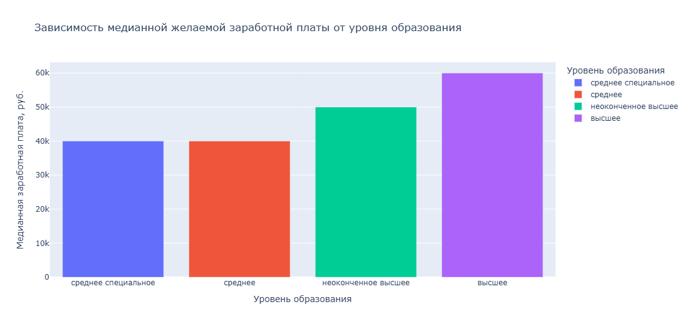
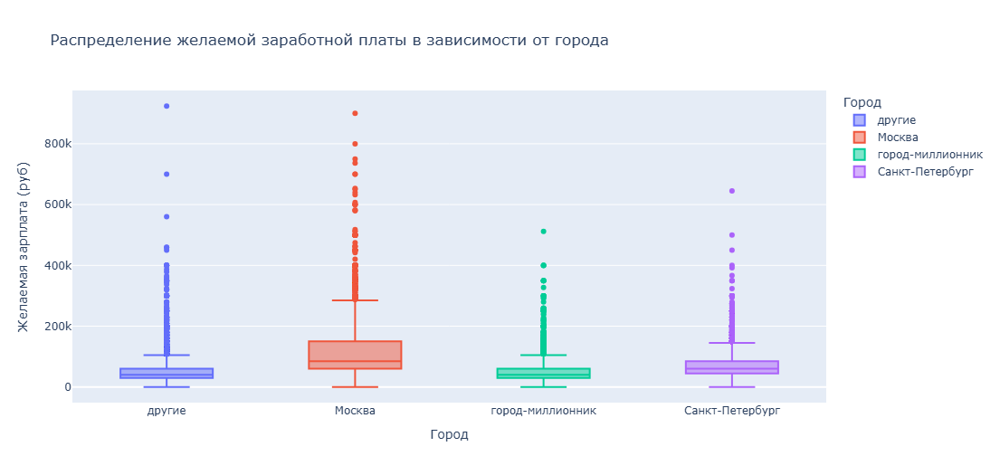
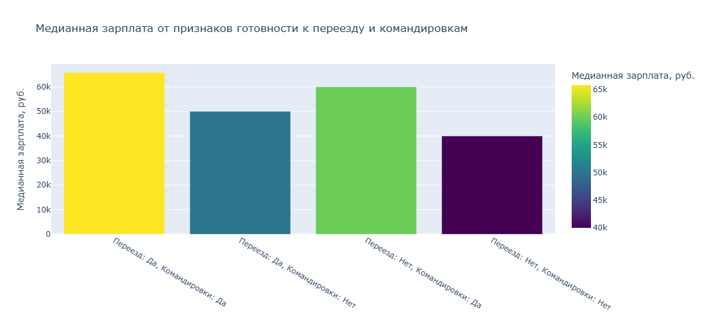
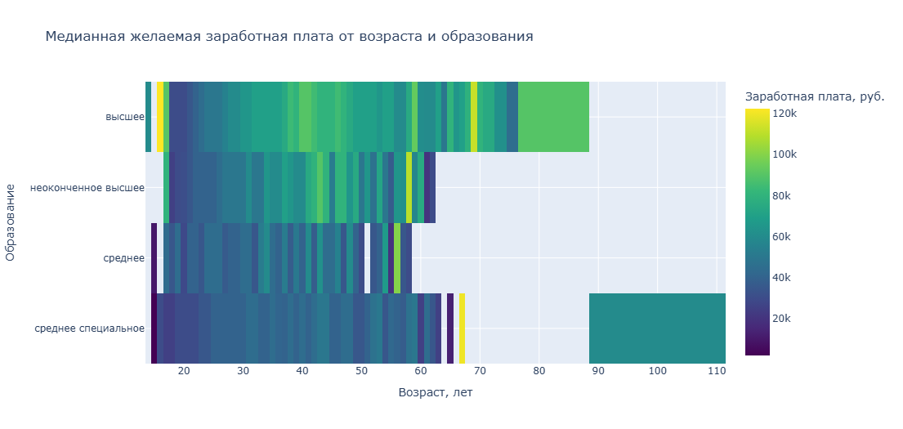
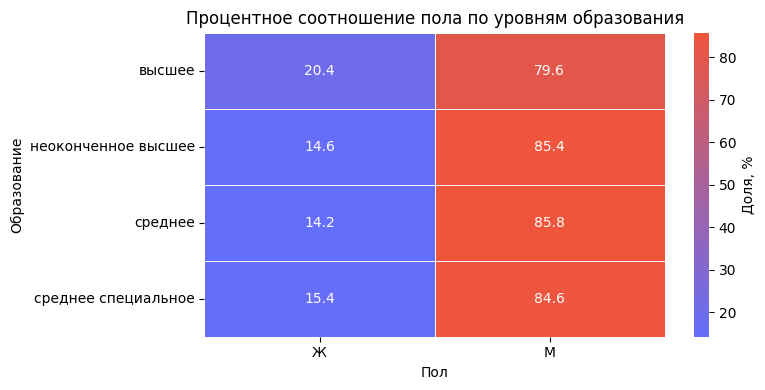
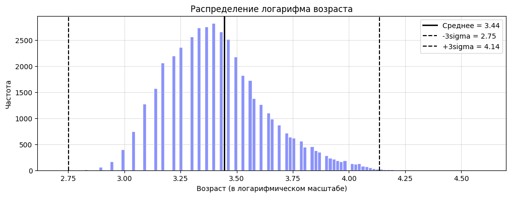

# Анализ резюме HeadHunter

**Проект по анализу данных резюме с платформы HeadHunter для построения модели автоматического определения уровня заработной платы.**

## 💫 Цель проекта
Анализ данных для построения модели для автоматического определения примерного уровня заработной платы, подходящей пользователю, на основе информации из его резюме.

## 🗂️ Описание данных

### [Основной датасет](https://drive.google.com/file/d/1Mub5r_-TAIeeomd-kqYQXxHWjSn1xkR0/view) 
`dst-3.0_16_1_hh_database.csv`
- **Объем:** 47k+ резюме
- **Признаки:** 10+ характеристик включая возраст, опыт, образование, зарплатные ожидания, город, готовность к переезду
- **Источник:** HeadHunter (публичные данные)

### [Курсы валют](https://drive.google.com/file/d/1qyHrC3W64SBKWSXKMQorspAkN-_4O7q6/view)
`ExchangeRates.csv`

Используется для конвертации зарплатных ожиданий в иностранной валюте в рубли по актуальным курсам для единообразного анализа.

## ⚙️ Установка и использование
### В Google Colab:

## 🚀 Этапы анализа

1. Базовый анализ структуры данных
2. Преобразование данных
3. Разведочный анализ EDA
4. Очистка данных

### Методы анализа:
- Категоризация текстовых данных
- One Hot Encoding для мультизначных категорий
- Конвертация валют с учетом исторических курсов
- z-score для выявления выбросов
- log преобразования для асимметричных распределений

## 📊 Интерактивные визуализации
### В GitHub Pages:

Все графики полностью интерактивны: масштабируйте, наводите для деталей, переключайте легенды.

## 👀 Превью графиков
### 1. Распределение признака "Возраст"

*Наиболее часто встречающийся возраст — 30 лет. Диапазон значений широк: от 14 до 100 лет. Возраст большинства соискателей (центральные 50% данных) находится в интервале от 27 до 36 лет. Аномалии лежат ниже ~10 и выше ~53 лет.*

### 2. Распределение признака "Опыт работы (месяц)"

*Модальное значение опыта работы — 81 месяц (~6.8 лет). Диапазон — от 1 до 1188 месяцев (99 лет). Опыт большинства соискателей лежит в интервале от 57 до 154 месяцев (~4.7-12.8 лет). Аномалии — выше ~300 месяцев (25 лет).*

### 3. Распределение признака "ЗП (руб)"

*Диапазон значений экстремально широк: от 1 рубля до 24,3 млн рублей. Зарплата большинства соискателей находится в интервале от 37 000 до 95 000 рублей. Аномалии лежат выше ~182 000 рублей. 5 соискателей требуют зарплату выше 1 млн рублей.*

### 4. Зависимость медианной ЗП от уровня образования

*Наибольшие медианные зарплатные ожидания у соискателей с высшим образованием, наименьшие — со средним. Признак уровня образования является существенно важным фактором при прогнозировании заработной платы.*

### 5. Распределение ЗП в зависимости от города

*Медианные ожидания выше всего в Москве и Санкт-Петербурге, ниже — в городах-миллионниках, минимальны — в остальных. Размахи похожи, но в столицах больше высоких выбросов. Признак города важен для прогнозирования ЗП.*

### 6. Зависимость медианной ЗП от готовности к переезду и командировкам

*Максимальную медианную ЗП (~66 тыс. руб.) имеют кандидаты, готовые и к переезду, и к командировкам. Минимальную (~40 тыс. руб.) — те, кто не готов ни к тому, ни к другому. Готовность к мобильности существенно повышает ожидания.*

### 7. Зависимость медианной ЗП от возраста и образования (тепловая карта)

*Внутри каждой образовательной группы с возрастом зарплатные ожидания растут. Наиболее высокие значения — у обладателей высшего образования в возрасте 30-40 лет. Образование остается решающим фактором во всех возрастах.*

### 8. Зависимость опыта работы от возраста (диаграмма рассеяния)

*Наблюдается ожидаемая положительная зависимость: с ростом возраста увеличивается опыт. 7 точек лежат выше линии "опыт = возраст" и являются аномалиями (опыт работы превышает или равен возрасту соискателя).*

### Дополнительные визуализации

*Мужчины-соискатели существенно преобладают в большинстве образовательных категорий, особенно среди обладателей среднего и неоконченного высшего образования.*

*Распределение логарифма возраста асимметрично влево, что подтверждает правую асимметрию исходного распределения, вызванную наличием соискателей старшего возраста.*

## 🔥 Ключевые выводы

Анализ характеристик соискателей показал, что их основная часть (50%) находится в возрастном диапазоне 27-36 лет с модальным возрастом 30 лет, имеет опыт работы от 4,7 до 12,8 лет (мода — 6,8 лет) и ожидает зарплату в пределах 37-95 тысяч рублей. При этом выявлены следующие зависимости: более высокие зарплатные ожидания коррелируют с наличием высшего образования, местом проживания в Москве или Санкт-Петербурге, а также с готовностью к переезду и командировкам; также в данных наблюдаются аномалии, когда заявленный опыт работы превышает возраст соискателя.

---
🐍 *Проект выполнен в рамках учебного задания по анализу данных.*
